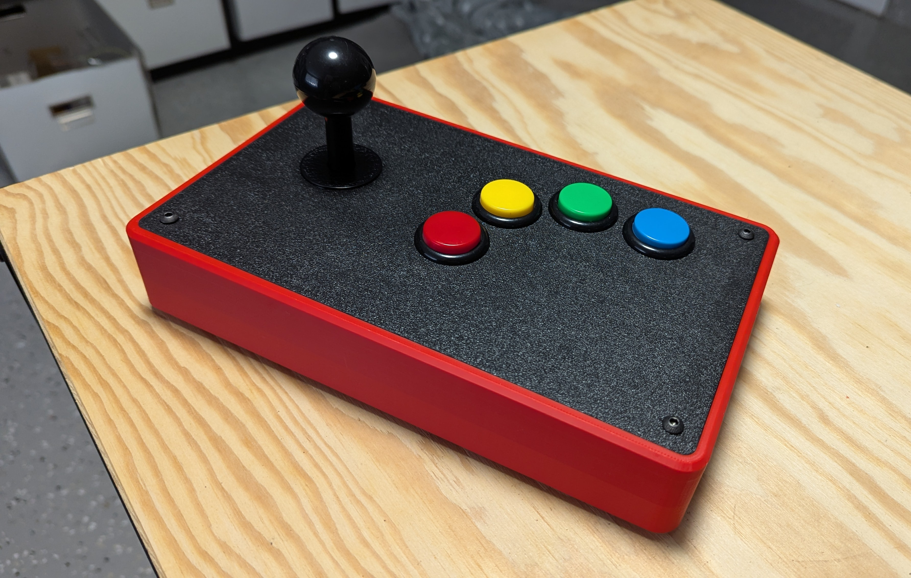

# Open Stick Mini - Neo Geo Edition

This is a simple remix of the Open Stick Mini by TheTrain (attribution is below).

Changes
- Top panel converted to 4 x 30mm buttons.
- Added 3mm height on the frame, the top piece then becomes the "mid" piece. I then make another top 3mm piece without the joystick mounting holes (I do not like joystick mounting holes).
- 2 versions of the top panel are included, 1 has counter sunk holes, another has regular holes for pan / button top bolts.
- 2 x aux buttons removed on the frame, changed the remaining 2 buttons to 16mm push buttons.
- Removed posts for a PCB.
- No OLED screen support on this.

Everything below is a copy and paste from the original repo. I have made changes to the below that is relevant to this project. You can identify this with anything that has a strike through is from the original and my changes are listed next to it.

---

!!!WARNING!!!

I am not responsible for prints that do not turn out as intended or any damages that occur as a result of installation or usage of this case.

!!!WARNING!!!

---

## Attribution

Based on the Open Stick Mini by TheTrain. (https://github.com/OpenStickCommunity/Hardware/blob/main/3D%20Prints/Open%20Stick%20Mini/README.md)

Copyright © 2025 [TheTrain](http://x.com/thetrain24) 

[Licensed under CC BY 4.0](https://creativecommons.org/licenses/by/4.0/)

Changes from the original design:
  - See above for list of changes.

Anyone selling this commercially must include in the listing that this is an open source item, link to the original repo and include the copyright as well as the link to my X account.

---

## Warnings / Disclaimer

Please note the following warnings / disclaimer:
- This is designed specifically for the Sanwa JLF lever.  It will not work with other levers.  It should work with the JLX but has not been tested.
- I am not responsible for prints that fail or do not turn out as intended.
- I am not responsible for any damage that happens to your printer or parts of your printer as a result of printing these files.
- If you make and sell these units you are responsible for supporting your own customers.

## Summary

The goal of this project was to create a high quality fightstick case that could be printed on a 250mm x 250mm print bed in parts.  The Open Stick Mini is a continuation of the original Open Stick Case design to allow for greater flexibility and customization of individual parts while reducing the chances of print failures on the main frame.  The Open Stick Mini uses less than 450g of filament to print so it a very low cost and sturdy case.  You should be able to print two units out of a single 1kg roll.  

---

## Printing and Construction

This project is now complete and I have printed and checked the final version of each file.  If there are improvements made and those files will be posted when I make them.

Please note that I am not taking on requests for other layouts at this time.  The STLs and STEP files have been posted so you can be easily edited in TinkerCAD or Fusion360 (or the program of your choice).

This case was printed on a Bambu Labs X1C and P1S printer with the following changes to settings:
- 4 outer walls (Bambu Lab - 4 Wall loops)
- Hex infill
- 15% infill

Please note that while no supports are needed for the printing of this case and its parts, you may choose to add supports to the main frame for the button holes that will print vertically if you think your printer will benifit from it.

This case was printed using Bambu Labs matte and normal PLA filament, I have not tested it with other filaments.

Each piece should be placed flat down on the print bed to ensure maximum strength. 

The following hardware is needed to assemble the case:
- 4 x M4 35mm brass standoffs
- 12 x M4 14mm countersunk hex bolts (ommit 4 bolts here if you using button head bolts.
- ****4 x M4 16mm buttonhead hex bolts (if not using the countersunk top piece)****
- 4 x M4 flange nuts
- 2 x M3 18mm countersunk hex bolts
- 2 x M3 nuts
- 1 x Neutrik USB-B to USB-A port

Please note: If you choose to use another type of USB connector port that is not Neutrik it may not fit.

Assembly:
- The M4 35mm brass standoffs slide into the four corner posts and should be friction fit.
- The JLF lever is secured with four M4 14mm countersunk bolts secured with either flange or acorn nuts.
- ~~The top and bottom plate are secured with four (each) M4 14mm countersunk bolts.~~ ****Bottom piece is secured with four M4 14mm countersunk bolts. Top piece can be secured with 4x M4 14mm countersunk bolts or 4x M4 16mm button head bolts.****
- The Neutrik port is secured with two M3 18mm countersunk hex bolts and two M3 nuts.

